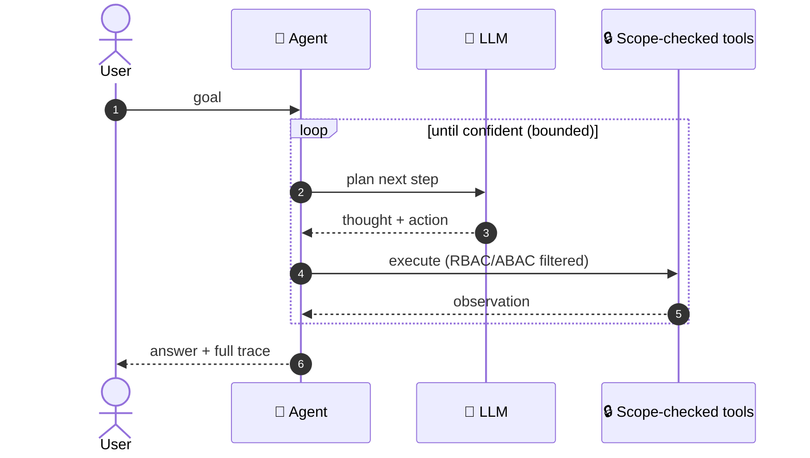
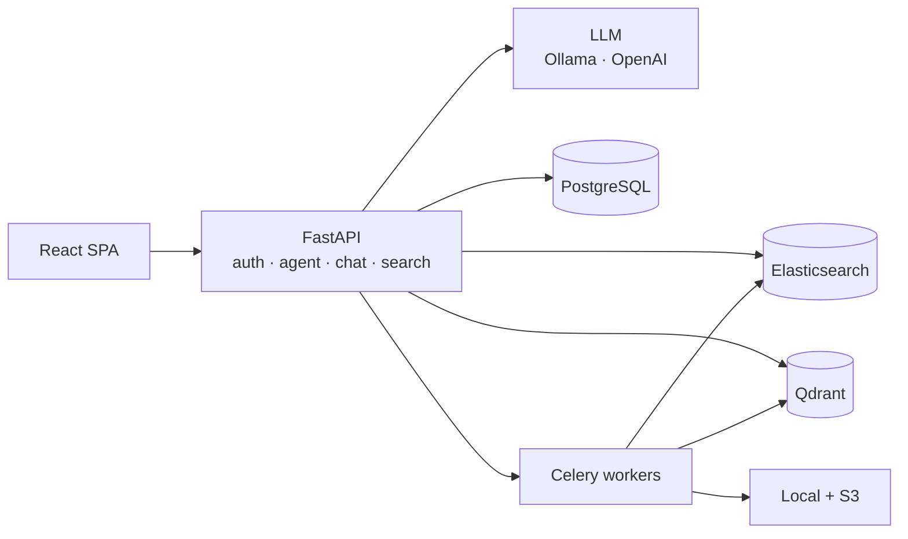

<div align="center">

# 🧭 inDoc

### Autonomous document intelligence that *investigates* — privately, on your own infrastructure.

Ask a question. Watch an AI agent **plan → search → read → re-plan** across your documents until it can answer — with a full audit trace and access control it can never cross.

[](https://github.com/sharedoxygen/indoc/actions/workflows/security.yml)
[](https://github.com/sharedoxygen/indoc/actions/workflows/ci.yml)


### ▶ **[Launch the interactive demo](https://claude.ai/code/artifact/13037d77-354d-46a5-a4a2-17fdd467dfaf)** — press *Run* and watch the agent reason on live instrumentation.

</div>

---

## 🎬 Watch it think

A **real** trace — one goal in, the model chooses every move:

> **Goal:** *"What was Q3 revenue and its growth rate?"*

| # | 🟠 Think | 🟢 Act | 🔵 Observe |
|:-:|---|---|---|
| **1** | *Find the financial report first.* | `search_documents("revenue")` | → **Q3 Financial Report** |
| **2** | *Read it for the exact figure.* | `read_document(9f6c…)` | *"…$4.2M, up 18% YoY…"* |
| **✓** | *I have the figure.* | `finish` | **Q3 2025 revenue was $4.2M, up 18% YoY** |

Nothing there was hard-coded. This is what makes it an **agent**, not RAG — the model decides each step, chains tools, and stops when it has evidence.



Available at **`POST /agent/run`** (answer + trace) and **`POST /agent/stream`** (live SSE).

---

## 🧩 What's inside

| | |
|---|---|
| 🧭 **Agentic AI** | ReAct loop · 6 scope-enforced tools · live trace streaming |
| 🔎 **Hybrid search** | Elasticsearch (keyword) + Qdrant (vector), score-fused |
| 💬 **Chat** | Multi-doc, streaming, cited, memory-aware |
| 🤖 **LLM** | Ollama (local, private) → OpenAI fallback |
| 🔐 **Security** | JWT · TOTP MFA · RBAC/ABAC · DLP · field encryption |
| 📋 **Compliance** | HIPAA / PCI-DSS / GDPR modes · SIEM export · full audit |
| 🦠 **Pipeline** | Virus scan → OCR extract → embed → dual-index, async on Celery |

<details>
<summary><b>🏗️ Architecture (click to expand)</b></summary>



**Stack:** FastAPI · Python 3.11 · React 18 + TypeScript · PostgreSQL · Redis · Celery · Elasticsearch · Qdrant · Docker.
</details>

---

## 🚀 Quick start

```bash
git clone https://github.com/sharedoxygen/indoc.git && cd indoc
cp .env.example .env          # set JWT_SECRET_KEY + FIELD_ENCRYPTION_KEY
docker-compose up -d          # Elasticsearch, Qdrant, Redis, Celery
pip install -r requirements.txt && uvicorn app.main:app --reload
cd frontend && npm install && npm run dev
```

App → **http://localhost:5173** · API docs → **http://localhost:8000/api/v1/docs**

---

## 🔒 Security first

**Autonomous, but accountable.** The agent is powerful *and* it physically cannot read a document the requesting user isn't authorized to access — every tool call runs through the platform's RBAC/ABAC scope. Self-hosted and air-gap capable, encrypted at rest and in transit, fully audited, and `gitleaks`-scanned in CI. Built for healthcare, legal, and financial teams where autonomous AI has to meet a compliance bar.

<div align="center"><sub>Built by <a href="https://www.sharedoxygen.com">Shared Oxygen, LLC</a> · <i>Autonomous, but accountable.</i></sub></div>
