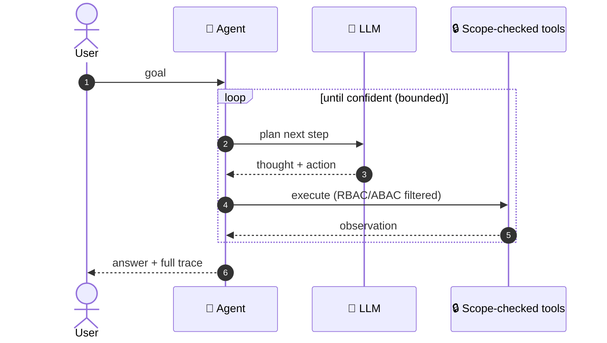
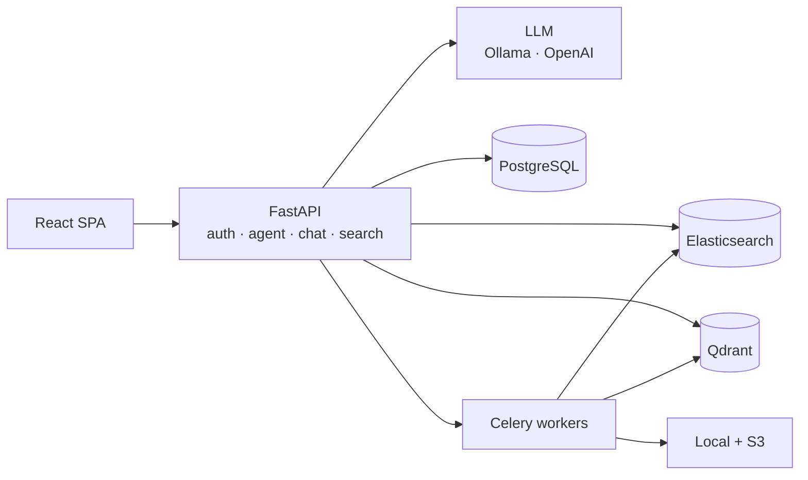

<div align="center">

# 🧭 inDoc

### Autonomous Document Intelligence That *Investigates* — Privately, On Your Own Infrastructure.

Ask a question. Watch an AI agent **plan → search → read → re-plan** across your documents until it can answer — with a full audit trace and access control it can never cross.

[](https://github.com/sharedoxygen/indoc/actions/workflows/security.yml?query=branch%3Amain)
[](https://github.com/sharedoxygen/indoc/actions/workflows/ci.yml?query=branch%3Amain)


### ▶ **[Launch The Interactive Demo](https://sharedoxygen.github.io/indoc/)** — Press *Run* And Watch The Agent Reason On Live Instrumentation.

</div>

---

## 🎬 Watch It Think

A **real** trace — one goal in, the model chooses every move:

> **Goal:** *"What was Q3 revenue and its growth rate?"*

| # | 🟠 Think | 🟢 Act | 🔵 Observe |
|:-:|---|---|---|
| **1** | *Find the financial report first.* | `search_documents("revenue")` | → **Q3 Financial Report** |
| **2** | *Read it for the exact figure.* | `read_document(9f6c…)` | *"…$4.2M, up 18% YoY…"* |
| **✓** | *I have the figure.* | `finish` | **Q3 2025 revenue was $4.2M, up 18% YoY** |

Nothing there was hard-coded. This is what makes it an **agent**, not RAG — the model decides each step, chains tools, and stops when it has evidence.



Available at **`POST /api/v1/agent/run`** (answer + trace) and **`POST /api/v1/agent/stream`** (live SSE: `start` / `step` / `final` / `error`).

---

## 🧩 What's Inside

| | |
|---|---|
| 🧭 **Agentic AI** | ReAct loop · 6 scope-enforced tools · live SSE trace · step budget + repeat-action guard |
| 🔎 **Hybrid Search** | Elasticsearch (keyword) + Qdrant (vector), score-fused |
| 💬 **Chat** | Multi-doc, streaming, cited, memory-aware |
| 🤖 **LLM** | Ollama (local, private) → OpenAI fallback |
| 🔐 **Security** | JWT · TOTP MFA · RBAC/ABAC · DLP · field encryption |
| 📋 **Compliance** | HIPAA / PCI-DSS modes · SIEM export · full audit |
| 🦠 **Pipeline** | Virus scan → OCR extract → embed → dual-index, async on Celery |

<details>
<summary><b>🏗️ Architecture (Click To Expand)</b></summary>



**Stack:** FastAPI 0.104 · Python 3.11 · React 18 + TypeScript · PostgreSQL · Redis · Celery · Elasticsearch 8.11 · Qdrant 1.7 · Docker.
</details>

---

## 🚀 Quick Start

Postgres and Redis are **external shared services** (local Homebrew or cloud managed). The Docker stack is compute/search only — scale API/workers horizontally against that shared data plane.

```bash
git clone https://github.com/sharedoxygen/indoc.git && cd indoc
cp .env.example .env          # JWT_SECRET_KEY, FIELD_ENCRYPTION_KEY, POSTGRES_*, REDIS_*
# Local isolation (once): psql -U postgres -f scripts/setup/ensure_baremetal_isolation.sql
docker compose up -d          # ES, Qdrant, Celery, Flower, backend, Prometheus, Grafana
cd frontend && npm install && npm run dev
```

App → **http://localhost:5193** · API docs → **http://localhost:8001/api/v1/docs** (host `:8000` reserved for PATi)

---

## 🔒 Security First

**Autonomous, but accountable.** The agent is powerful *and* it physically cannot read a document the requesting user isn't authorized to access — every tool call runs through the platform's RBAC/ABAC scope. Self-hosted and air-gap capable, encrypted at rest and in transit, fully audited, and `gitleaks`-scanned in CI. Built for healthcare, legal, and financial teams where autonomous AI has to meet a compliance bar.

<div align="center"><sub>Built by <a href="https://www.sharedoxygen.com">Shared Oxygen, LLC</a> · <i>Autonomous, but accountable.</i></sub></div>
